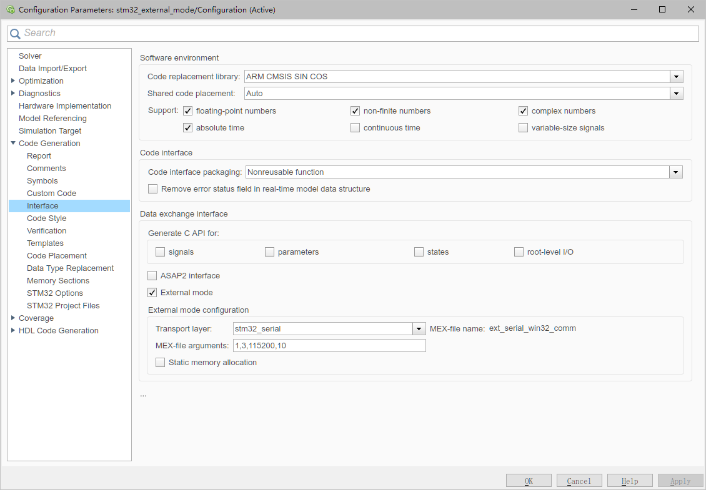
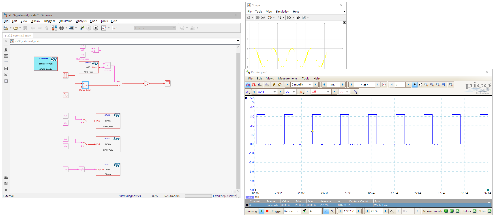
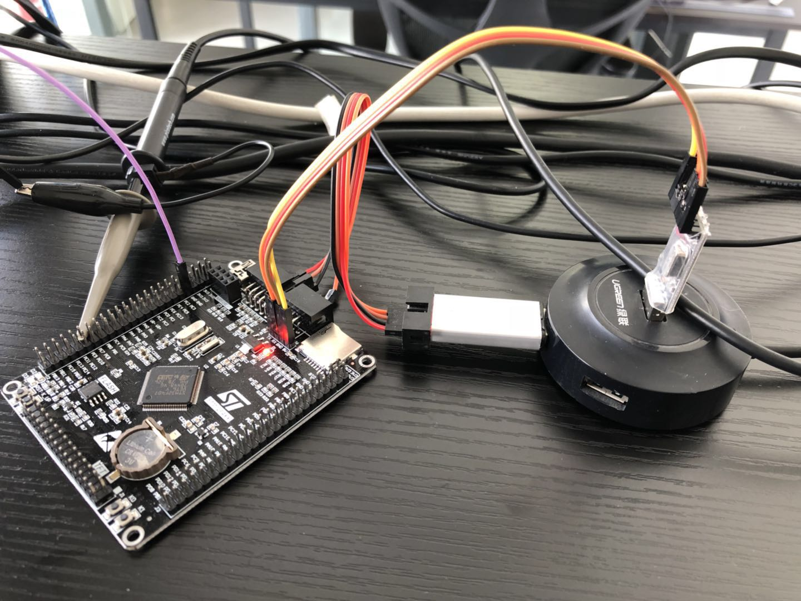

# STM32 Target support package usage - External Mode

1. Creation of STM32CubeMX ioc file, IMPORTANT: set min heap size to 0x3000 or above to ensure correct communication between PC and STM32
2. assign each component in simulink
3. Set configuration of interface

4. first click "Build Model" button on the toolbar to build the model and generate keil project, download the project and run it in STM32 hardware
5. Click "Connect to target" button on the toolbar to establish connection between PC and STM32

6. During the runtime, you can adjust parameters of the hardware in real-time

